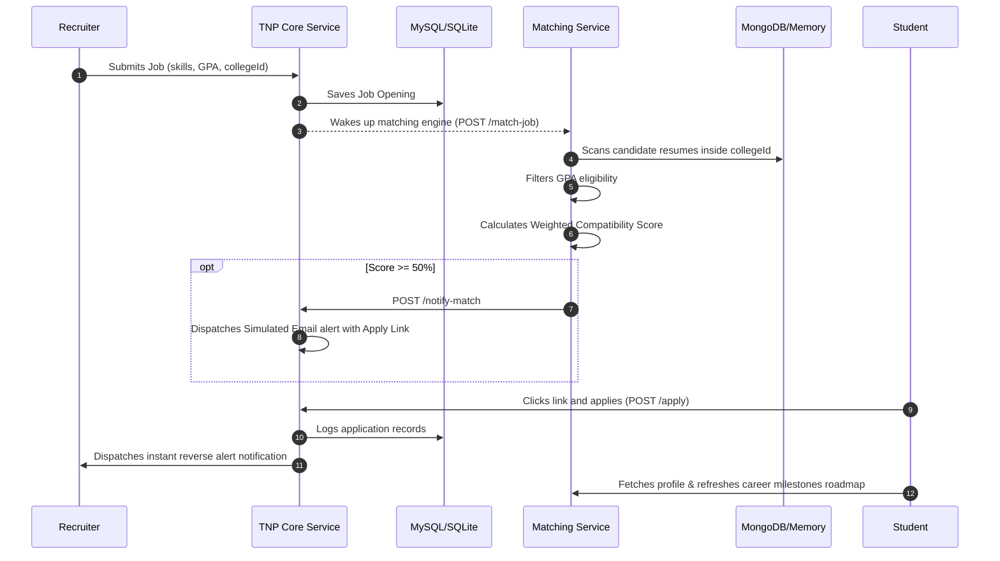

# HireLink Enterprise Microservices Architecture

This document describes the design patterns, microservice boundaries, data schemas, security architectures, and automated pipelines of **HireLink: The College-Isolated Training & Placement (TNP) Portal**.

---

## System Diagram & Data Boundaries

```
                         +------------------------+
                         |  React / Vite Frontend |
                         +-----------+------------+
                                     |
                                     v HTTP / CORS
                         +-----------+------------+
                         |      API Gateway       |
                         |  (Rate Limiter, Helmet)|
                         +----+------+-------+----+
                              |      |       |
         +--------------------+      |       +--------------------+
         | Proxy /api/auth           | Proxy /api/tnp             | Proxy /api/matching
         v                           v                            v
+--------+--------+         +--------+--------+          +--------+--------+
|  Auth Service   |         |TNP Core Service |          |Matching Service |
| (Prisma/SQLite) |         | (Prisma/SQLite) |          |  (JSON/Mongo)   |
+-----------------+         +--------+--------+          +--------+--------+
                                     |                            ^
                                     | Call matching trigger      |
                                     +----------------------------+
```

---

## 1. Zero-Trust API Gateway Routing & Context Injection
The gateway acts as the secure reverse-proxy orchestrating all entries to the internal cluster microservices on port `5000`.
- **Helmet Headers Policy**: Strict Content-Security-Policy (CSP) and HSTS setups protect candidates against XSS injection attacks.
- **Express-Rate-Limiter**: Shield endpoints against brute force credential threats by restricting IPs to `100` calls per 15-minute cycle.
- **Credential Decoupling**: Frontend never transmits the sensitive database identification numbers directly. Instead, the Gateway decodes the signed JSON Web Token (JWT), captures candidate context (`userId`, `role`, `collegeId`, `email`, `name`), and passes these internally to microservices using custom HTTP headers:
  - `X-User-Id`
  - `X-User-Role`
  - `X-User-College-Id`
  - `X-User-Email`
  - `X-User-Name`

---

## 2. Multi-Tenant Isolated College Boundaries
Enterprise scaling requires complete physical or logical segmentation of database views to secure student files. 
- In **HireLink**, strict logical segmentation is enforced at the DB query controller layer inside `tnp-core-service`.
- Every SQL query filtering Jobs, Applications, or student lists strictly includes:
  `where: { collegeId: gatewayUser.collegeId }`
- This ensures that a student logged in under college `MIT` can *never* query, view, or apply to job postings created inside college `STANFORD`.

---

## 3. High-Fidelity Automated Trigger Pipeline Flow

The platform functions as an automated continuous event pipeline:



---

## 4. Databases and Environment Variables

For zero-install local compilation, the microservices employ **SQLite** databases out-of-the-box, with configurations supporting instant swap to **MySQL** and **MongoDB Atlas** for high-load production environments.

### Downstream Ports
- **API Gateway**: `5000`
- **Auth Service**: `5001`
- **TNP Core Service**: `5002`
- **Matching Service**: `5003`
- **Vite React Frontend**: `5173`
